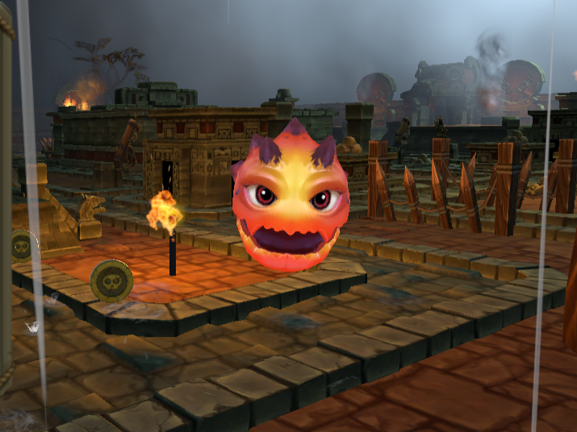
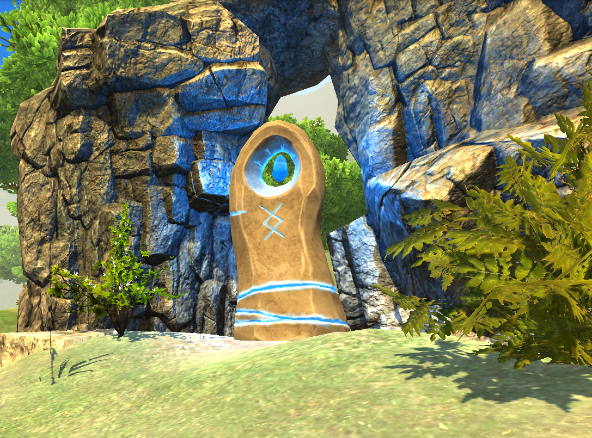

<!-- Animated Typing Header -->

 

 

---

### About Me

I like to build things, products, prototypes, half-finished experiments at 2am. Some make it to production, others exist purely for the joy of figuring out how they work. I've been writing code for over a decade, but the curiosity hasn't worn off yet.

By day, I juggle IT infrastructure and software engineering, solving problems across systems, automation, and security. By night (and weekends), I run **[Nanware](https://nanware.uy)**, my personal workshop where I explore game development, tinker with new tech, and chase whatever idea won't leave me alone.

I'm particularly drawn to understanding *how things work under the hood*. Whether it's reverse-engineering classic arcade movement, figuring out why a procedural algorithm produces certain patterns, digging into how a device communicates over BLE, or modding games to see what makes them tick, the investigation is half the fun.

Versatility is the game. Creativity is the fuel.

---

### Currently Building

<table>
<tr>
<td width="50%" valign="top">

**[Pac-Ztec](https://nand3z.itch.io/pac-ztec)**

A 3D Pac-Man reimagining with an Aztec twist. Built in Unity, focused on recreating the precise grid-based movement that made the original tick. Custom waypoint system, procedural maze generation using recursive backtracking with braiding, and way too much time thinking about how ghosts should behave.

The goal isn't just to clone a classic, it's to understand *why* it works. Every mechanic is an excuse to dig deeper.

`Unity` `C#` `Procedural Generation`

</td>
<td width="50%" valign="top">

**Tidal Treachery**

Mobile arcade-exploration game. Snake meets pirate adventure: navigate an ever-moving ship through procedural oceans, collect loot, raid islands, upgrade your vessel. Roguelike structure with meta-progression between runs.

Constant motion as the core constraint. Simple touch controls, one-handed play, 15-45 minute sessions. Currently in early design exploring the core loop.

`Unity` `C#` `Mobile` `Roguelike`

</td>
</tr>
<tr>
<td width="50%" valign="top">

**[The Watcher](https://play.unity.com/es/games/083c80c7-8fef-4417-914f-7a714aa2841f/the-watcher-academic-terrain-demo)**

A peaceful first-person sandbox built to explore Unity's terrain tools, quest mechanics, and interactive world systems. Less about winning, more about wandering and seeing what the engine can do.

`Unity` `C#` `Terrain` `Sandbox`

</td>
<td width="50%" valign="top">

**[Ringalytics](https://github.com/nandez/ringalytics)**

Open source Android app for reading smart ring data. An AI-assisted experiment built with Flutter, inspired by the Gadgetbridge project. Born from curiosity about what data these devices actually collect and how to access it without vendor lock-in.

`Flutter` `Dart` `Android` `Open Source`

</td>
</tr>
</table>

---

### Tech Stack

Tools I reach for depending on what I’m building; game dev, apps, automation scripts, or whatever rabbit hole I’ve fallen into. Not comprehensive, but a few of them:

---

### Down to Collaborate

- **Open source.** If it's something I use or believe in, I'm happy to contribute. Especially interested in reverse engineering, automation, and developer tooling.

- **Game jams.** Short bursts of creative chaos, weird ideas, tight deadlines. If you're putting together a team and need someone who can code mechanics, debug at 3am, and still find it fun, hit me up.

- **Game modding.** I like pulling games apart to understand how they work. If you're building tools or mods and need an extra pair of hands, I'm not scared of digging into files and formats.

---

 
 
 

### Gotta commit 'em all

_How to keep a knowledge tadpole alive? Easy... feed it code every day..._

<picture>
  <source media="(prefers-color-scheme: dark)" srcset="https://raw.githubusercontent.com/nandez/nandez/output/github-contribution-grid-snake-dark.svg">
  <source media="(prefers-color-scheme: light)" srcset="https://raw.githubusercontent.com/nandez/nandez/output/github-contribution-grid-snake.svg">
  
</picture>

---

_I see code as a canvas and technology as a medium for things meant to be played, felt, or simply wandered through. Not everything needs to ship. Sometimes it's enough to leave behind a small mark, a piece of something that might help someone else, somewhere, someday._

_That's the goal, choom. Never fade away..._

